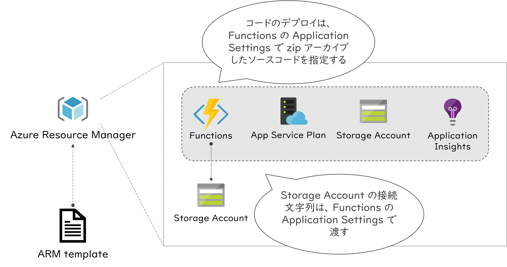

# ARMテンプレートハンズオン

## コンテンツ

- ARMテンプレートについて
- 環境準備
- セルフペース ハンズオン

## ARMテンプレートについて

下記資料をご参照ください。

- [今日から始めるARMテンプレート](https://www.slideshare.net/dzeyelid/getting-started-for-arm-template)

## 環境準備

本ハンズオンに取り組むにあたり、下記の環境をご準備ください。 **\*** は必須です。

| 必要なもの | 説明 |
|----|----|
| Azureアカウント (**\***) | Azureポータル上で作業するので、サインインして利用できるサブスクリプションがあることをご確認ください。Azureアカウントをお持ちでない場合は、こちら [Azure の無料アカウントを今すぐ作成しましょう - Microsoft Azure](https://azure.microsoft.com/ja-jp/free/) から無料枠で利用できるアカウントを作成することができます。 |
| Webブラウザ (**\***) | Microsoft Edge, Google Chrome, Safari などをご利用ください。なお、Internet Explorer では Azureポータルがうまく動作しないことがあります。 |

なお、ARMテンプレートは JSON 形式で記述されています。JSON 形式について不安がある方はあらかじめ確認しておいてください。

お手元のマシン上で作業される場合は、下記も併せてご用意ください。

| 必要なもの | 説明 |
|----|----|
| Azure CLI | こちら [Azure CLI のインストール - Microsoft Docs](https://docs.microsoft.com/ja-jp/cli/azure/install-azure-cli?view=azure-cli-latest) を参考にインストールしてください。 |
| Visual Studio Code | 下記の拡張機能と組み合わせると ARMテンプレートの編集がとても楽になるので、おすすめしています。お持ちでない方は、こちら [Download Visual Studio Code - Mac, Linux, Windows](https://code.visualstudio.com/Download) からインストールしてください。 |
| Visual Studio Code 拡張機能「Azure Resource Manager Tools」 | Visual Studio Code で ARMテンプレートを編集する際にとても便利です。Visual Studio Code 上で拡張機能を検索するか、こちら [Azure Resource Manager Tools - Visual Studio Marketplace](https://marketplace.visualstudio.com/items?itemName=msazurermtools.azurerm-vscode-tools) からインストールしてください。 |

また、本手順は、 [Azure Cloud shell](https://docs.microsoft.com/ja-jp/azure/cloud-shell/overview) でも実施することができます。Cloud shell には、Azure CLI や Visual Studio Code ベースのエディタがすでに組み込まれています。また、ファイルをアップロードすることもできます。ファイルアップロードに関しては、こちら [Cloud Shell にローカル ファイルを転送する | Microsoft Docs](https://docs.microsoft.com/ja-jp/azure/cloud-shell/persisting-shell-storage#transfer-local-files-to-cloud-shell) をご参照ください。

## セルフペース ハンズオン

### ハンズオン概要

ハンズオンでは、ARMテンプレートを用いて、ストレージアカウント (Blob) と連携する Azure Functions をデプロイします。

デプロイされる構成は、下記の機能を有しています。

- ユーザーから REST でリクエストを受けたら、リクエストごとにストレージアカウント (Blob) にファイルを書き込む
  - 書き込む内容は、HTTP クエリ文字列や POST のリクエストボディにて指定する

#### デプロイするリソース

| リソース | 説明 |
|----|----|
| Azure Functions | ソースコードは、 Node.js で記述する |
| App Service Plan | Azure Functions に付随する。ソースコードを Node.js で記述したいので、より適した Linux 環境を採用する |
| Storage Accounts | Azure Functions に付随する。 |
| Application Insights | Azure Functions に付随する。（必須ではないが、モニタリングのため不可欠） |
| Storage Accounts (ログ出力用) | Functions のサンプルコードから使用するストレージ |

#### 進め方

初めて ARMテンプレートを体験する方は、こちらの[解答例](./docs/selfpaced-handson.md) を参考に進めてください。ARMテンプレートを一から作るのではなく、Azureポータルでベースとなる ARMテンプレートを生成し、必要な部分を追記していく流れで進めます。

また、腕に自信のある方は [Azure Resource Manager テンプレートリファレンス - Azure template | Microsoft Docs](https://docs.microsoft.com/en-us/azure/templates/) などを参考に自力でテンプレート作成にチャレンジしてみましょう :muscle: 解答例では簡略化のためにAzureポータルで出力したテンプレートを使用していますが、必ずしもスマートではない（APIバージョンが古い、など）ため、慣れるにつ淹れて自力で書くようになると思います♪
