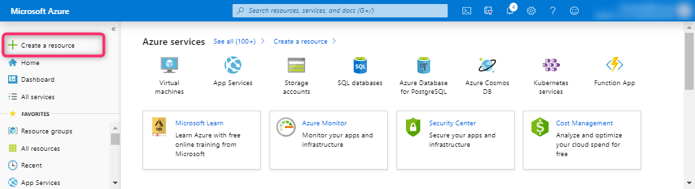
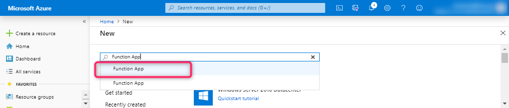
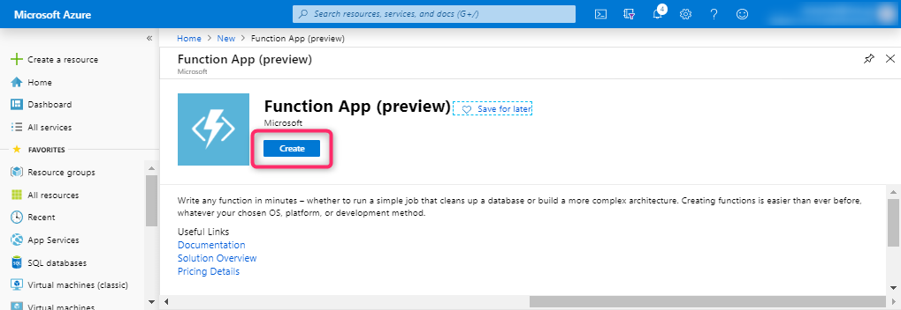
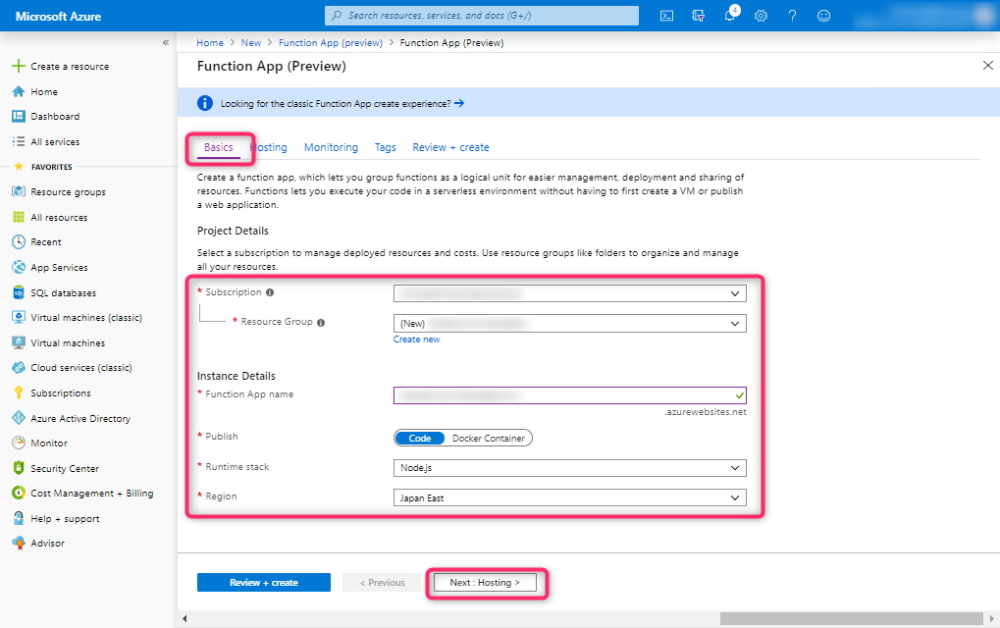
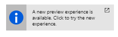
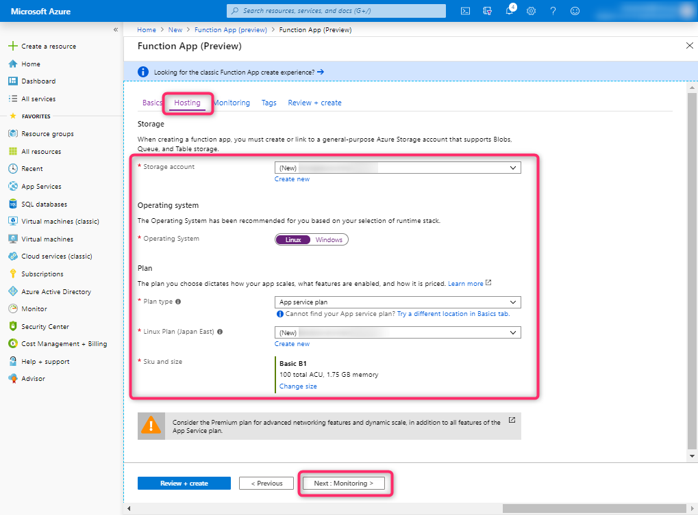
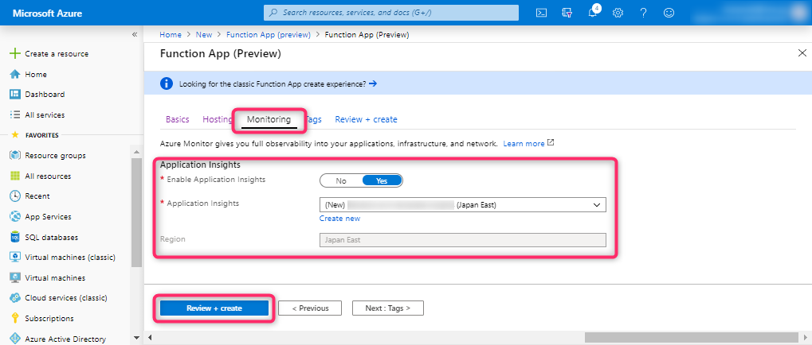
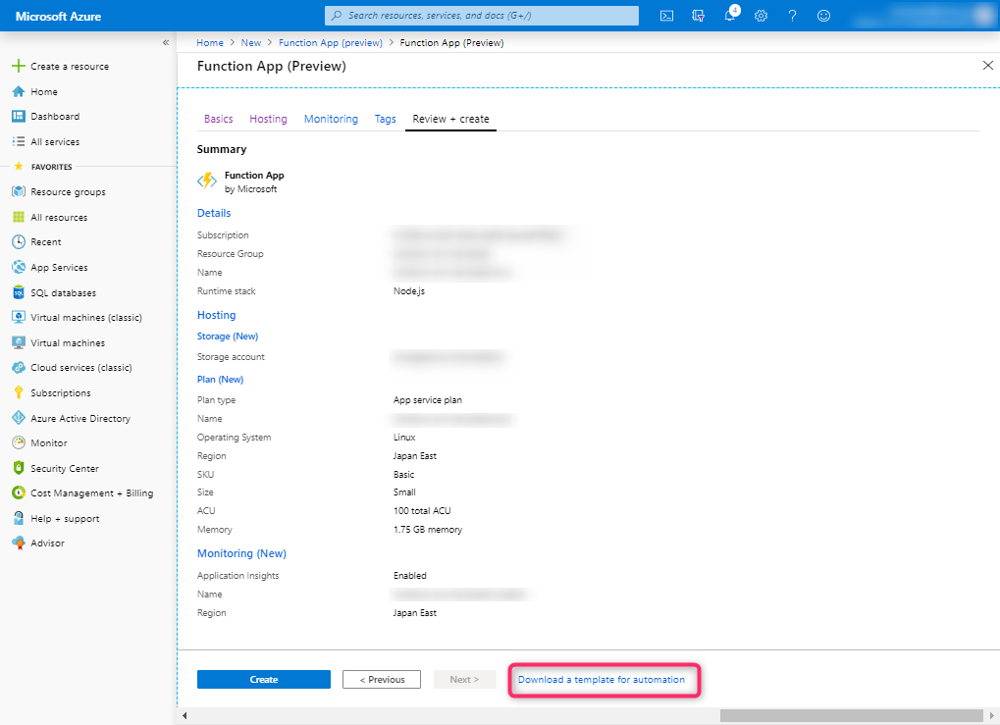
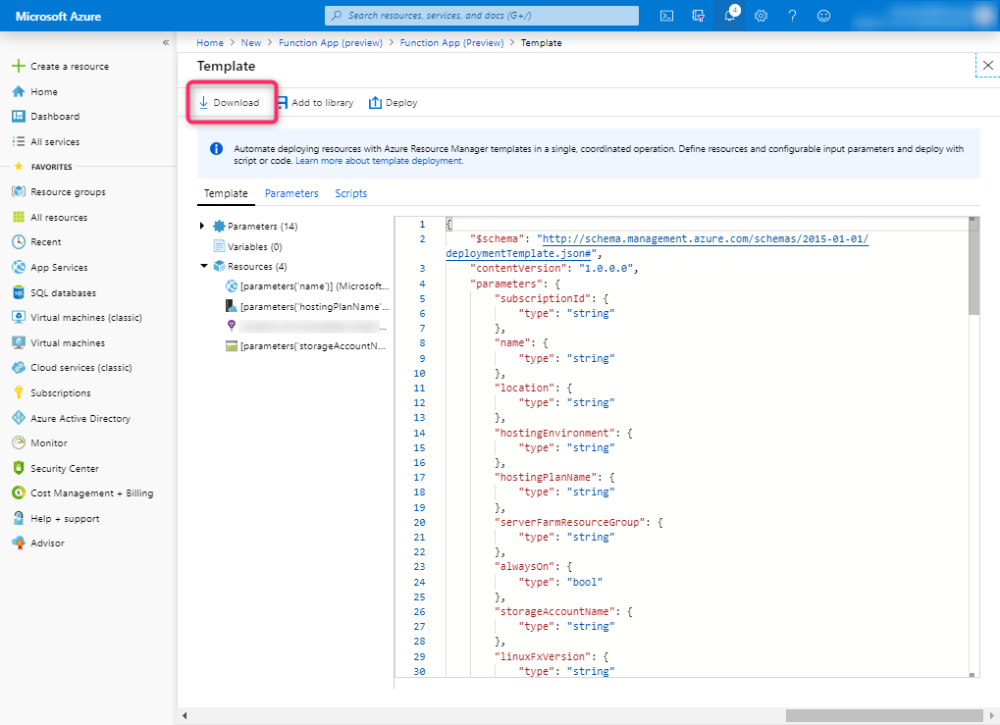

# セルフペースハンズオン

大まかな手順は下記のとおりです。

1. Azureポータルから、ベースとなる ARMテンプレートをダウンロードする
2. ARMテンプレートを編集する
3. ARMテンプレートを使ってリソースをデプロイする
4. 動作確認を行う

## 1. Azureポータルから、ベースとなる ARMテンプレートをダウンロードする

[Azureポータル](https://portal.azure.com) で、左メニューの「 + Create a resource」を選択し、リソースの新規作成を開きます。



検索欄で、 `Function App` と入力し、候補の「Function App」を選択します。



Function App の「Create」ボタンを選択します。



Function App 作成画面の Basics タブで各項目を入力し、「Next: Hosting >」を選択します。

| 項目 | 説明 |
|----|----|
| Subscription | 使用するサブスクリプションを選択する |
| Resource Group | 「Create new」を選択し、リソースグループ名を入力する |
| Function App name | Function App の名前を入力する |
| Publish | 「Code」を選択する |
| Runtime stack | 「Node.js」を選択する |
| Region | 「Japan East」を選択する |



もし、上図の画面と異なる場合は、下図のような案内から new experience を開いてください。(資料作成時点で Azureポータルが移行期間中であるための差異です。)



Hosting タブで各項目を入力し、「Next: Monitoring >」を選択します。

| 項目 | 説明 |
|----|----|
| Storage account | ストレージアカウント名を入力する（自動作成されたものでも、「Create new」から自身で入力しても構いません） |
| Operating System | 「Linux」を選択する |
| Plan type | 「App service plan」を選択する |
| Linux Plan (Japan East) | 「Create new」から Service plan の名前を入力する |
| Sku and size | 「Change size」を選択し、Dev/Test タブから B1 を選択し、「Apply」を選択する (OS が Linux の場合は B1 以上を選択する必要がある) |



Monitoring タブで各項目を入力し、「Review + create」を選択します。

| 項目 | 説明 |
|----|----|
| Enable Application Insights | 「Yes」を選択する |
| Application Insights | 「Create new」から Application Insights の名前を入力し、Location に「Japan East」を選択し、「OK」を選択する |



入力したパラメータが表示されるので確認し、「 **Download a template for automation** 」を選択します。



「 **Download** 」を選択して、テンプレートをダウンロードします。



## 2. ARMテンプレートを編集する

ダウンロードしたARMテンプレートには、下記の二つのファイルが含まれています。

- parameters.json
- template.json

`template.json` はデプロイするリソースの詳細が定義されており、そのなかには入力させたいパラメータの定義も含まれます。そして、 `parameters.json` には、そのパラメータが定義されています。

`template.json` を開き、構成を確認してみましょう。下記のように、 `$schema`, `contentVersion`, `parameters`, `resources` という構成の JSON になっていることがわかります。テンプレートの構造の詳細については、こちら [Azure Resource Manager テンプレートの構造と構文 | Microsoft Docs](https://docs.microsoft.com/ja-jp/azure/azure-resource-manager/resource-group-authoring-templates) をご参考ください。

```json
{
  "$schema": "https://schema.management.azure.com/schemas/2015-01-01/deploymentTemplate.json#",
  "contentVersion": "",
  "parameters": {  },
  "resources": [  ]
}
```

このままでも、上記の手順で設定した Azure Functions がデプロイできますが、さらに編集を加えてみましょう。

### 2-1. ストレージアカウントをもう一つ追加する

リソースの定義の仕方については、 [Azure Resource Manager template reference - Azure template | Microsoft Docs](https://docs.microsoft.com/en-us/azure/templates/) に示されています。

この定義を参考に、ストレージアカウントをもう一つ追加してみましょう。

`template.json` を開き、 `resources` の配列に、下記を追加します。直前のリソース定義にたいして、 `,` を続け、JSONの配列の記法に沿うように注意してください。

```json
,
{
  "name": "[parameters('storageNameForLog')]",
  "type": "Microsoft.Storage/storageAccounts",
  "apiVersion": "2019-04-01",
  "sku": {
    "name": "[parameters('storageSkuNameForLog')]"
  },
  "kind": "StorageV2",
  "location": "[resourceGroup().location]",
  "resources": [
    {
      "name": "[concat('default/', parameters('storageContainerNameForLog'))]",
      "type": "blobServices/containers",
      "apiVersion": "2019-04-01",
      "properties": {
        "publicAccess": "None"
      },
      "dependsOn": [
        "[resourceId('Microsoft.Storage/storageAccounts', parameters('storageNameForLog'))]"
      ]
    }
  ]
},
{
}
```

そして、このストレージアカウントはふたつのパラメータを参照するように記述されています。このパラメータについて定義を追加しましょう。 `parameters` のオブジェクトに、下記を追加して下さい。（既存のパラメータ定義に `,` が続くように追加することにご注意ください。）

```json
,
"storageNameForLog": {
  "type": "string"
},
"storageSkuNameForLog": {
  "type": "string",
  "allowedValues": [
      "Standard_LRS",
      "Standard_GRS",
      "Standard_RAGRS",
      "Standard_ZRS",
      "Premium_LRS",
      "Premium_ZRS",
      "Standard_GZRS",
      "Standard_RAGZRS"
  ]
},
"storageContainerNameForLog": {
  "type": "string",
  "defaultValue": "logs"
}
```

#### 2-1. 解説

ストレージアカウントを追加するために、 [Microsoft.Storage/storageAccounts 2019-04-01 - Azure template | Microsoft Docs](https://docs.microsoft.com/en-us/azure/templates/microsoft.storage/2019-04-01/storageaccounts) を確認しましょう。

ストレージアカウント名等のパラメータを定義する
リソースを追加する

#### 2-2. Azure Functions のアプリ設定 (Application settings) を更新する

次に、 Azure Functions の設定を追加します。

Azure FUnctions のリソース定義は `"type": "Microsoft.Web/sites"` と定義されているオブジェクトです。

このオブジェクトの `properties.siteConfig.appSettings` の配列に、下記を追加してください。

```json
,
{
  "name": "WEBSITE_NODE_DEFAULT_VERSION",
  "value": "10.14.1"
},
{
  "name": "WEBSITE_RUN_FROM_PACKAGE",
  "value": "https://github.com/dzeyelid/handson-arm-template/blob/master/functions.zip?raw=true"
},
{
  "name": "StorageAccountConnStrLog",
  "value": "[concat('DefaultEndpointsProtocol=https;AccountName=', parameters('storageNameForLog'), ';AccountKey=', listKeys(parameters('storageNameForLog'),'2019-04-01').keys[0].value)]"
}
```

#### 2-2. 解説

##### Node.js バージョンを指定する

Node.js のバージョンを指定するには、 Application settings の `WEBSITE_NODE_DEFAULT_VERSION` を設定します。選択できるバージョンはいくつかありますが、ドキュメントで推奨されている `10.14.1` を指定しましょう。

- 参考: [Azure Functions 用 JavaScript 開発者向けリファレンス | Microsoft Docs](https://docs.microsoft.com/ja-jp/azure/azure-functions/functions-reference-node#node-version)

##### Run from package でソースコードをデプロイさせる

Application settings に `WEBSITE_RUN_FROM_PACKAGE` を設定すると、 _Run from package_ というパッケージからコードを実行できる機能を指定できます。値に zip ファイルのURLを指定することで zip に含まれたソースコードをデプロイすることができます。

- 参考: [Azure Functions をパッケージから実行する | Microsoft Docs](https://docs.microsoft.com/ja-jp/azure/azure-functions/run-functions-from-deployment-package#enabling-functions-to-run-from-a-package)

この手順では、このリポジトリでホストしている zip アーカイブされたソースコードを指定しています。

##### ストレージアカウントの接続文字列を設定する

ストレージアカウントが使用する

https://docs.microsoft.com/ja-jp/azure/azure-resource-manager/resource-group-template-functions

## 3. ARMテンプレートを使ってリソースをデプロイする

ARMテンプレートを使ったデプロイをするために、今回は Azure CLI を利用します。インストールした Azure CLI を利用できる Command prompt, bash などのターミナルを開いて作業を進めてください。手順では Command prompt を利用します。ターミナルによって改行の文字が異なるので、適宜読み替えてください。

まずは、リソースグループを作成しましょう。今回ダウンロードしたテンプレートでは、 `<Resource group name>` には、前述の手順で Azureポータルで指定したリソースグループ名を指定する必要があります。（テンプレートを自作した場合はこの限りではありません。）

```cmd
# リソースグループを作成する
az group create ^
  --name <Resource group name> ^
  --location japaneast
```

さて、追加したストレージアカウントのパラメータは、 `parameters.json` に加えてもよいですが、ここでは `az` コマンドの引数から渡してみましょう。

下記のコマンドを実行します。 `<Resource group name>`, `<Storage account name>` は適宜置換えてください。

```cmd
# template.json があるディレクトリへ移動する
cd <Directory path that has template.json>

# パラメータを指定し、デプロイを実行する
az group deployment create ^
  --resource-group <Resource group name> ^
  --template-file template.json ^
  --parameters @parameters.json ^
  --parameters ^
    storageNameForLog=<Storage account name> ^
    storageSkuNameForLog=Standard_LRS
```

## 4. 動作確認を行う

Azure Functions に HttpTrigger という関数がデプロイされているので、これを実行すると、追加した方のストレージアカウントの logs コンテナにログが出力されます。この動作が確認できればデプロイ成功です。
